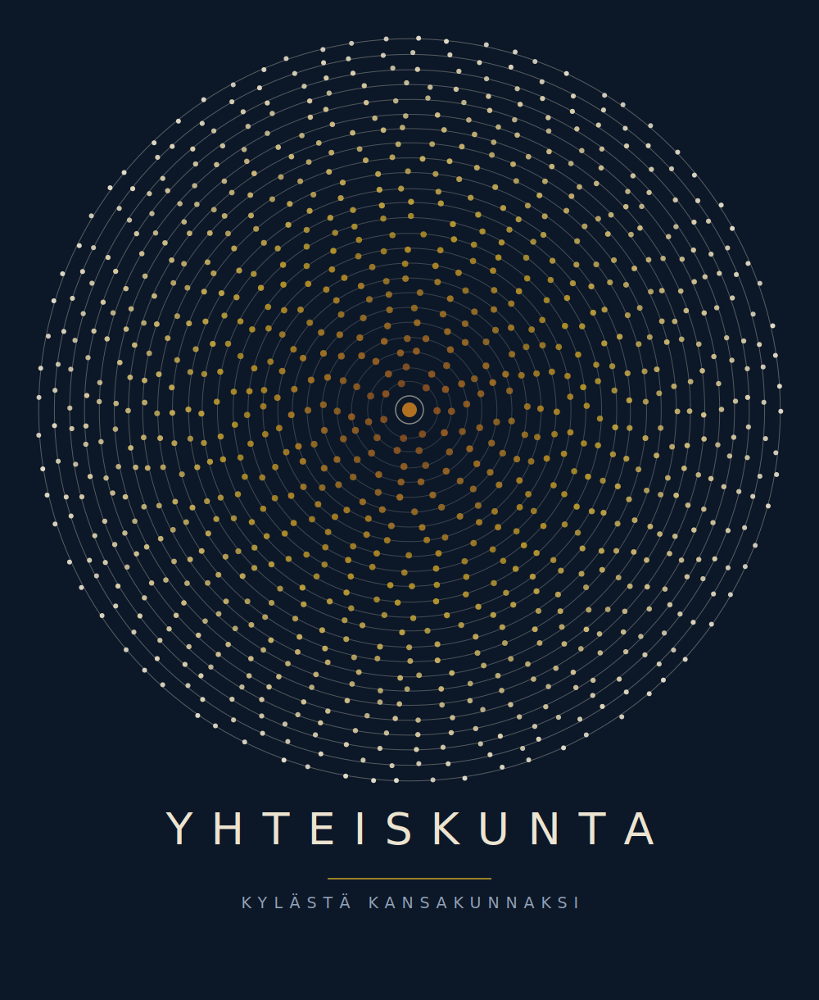

# Yhteiskunta (Society)



Suomenkielinen, selaimessa toimiva sivilisaatiosimulaatiopeli, jonka tarkoitus on auttaa yläkoulun ja lukion oppilaita ymmärtämään historiaa ja yhteiskuntaoppia mielekkäiden, seurauksellisten valintojen kautta.

Pelaaja johtaa 10 000 hengen yhteiskuntaa agraariajasta nykyaikaan tehden päätöksiä mm. hallinnosta, taloudesta, terveydenhuollosta, maataloudesta ja tutkimuksesta. Pelin lopuksi oppilas esittelee oman yhteiskuntansa tarinan luokkatovereille.

## Tiedostot

- `game/yhteiskunta.jsx` — Reactin lähdekoodi (komponentti), jota **Vite-build** (ks. alla) käyttää
- `game/yhteiskunta.html` — itsenäinen, suoraan selaimessa toimiva **CDN-fallback-versio** (React, ReactDOM, Recharts ja Babel ladataan CDN:stä; ei vaadi build-vaihetta eikä palvelinta). Avaa tuplaklikkaamalla missä tahansa selaimessa, myös ilman verkkoyhteyttä asennuksen jälkeen paitsi fonttien osalta. Säilyy tarkoituksella koskemattomana varajärjestelmänä siltä varalta että Vite-bundle pettää jossain ympäristössä.
- `data/tietolaatikot.js` — pelin tietolaatikoiden (ks. TIETOLAATIKKO_*.md) sisältö, klassinen `<script>`-yhteensopiva muoto — tämä on **muokattava lähdetiedosto**.
- `data/tietolaatikot.mjs` — sama sisältö ES-moduulina Vite-buildia varten. **Automaattisesti generoitu, älä muokkaa suoraan** — aja `node tools/build-tietolaatikot-esm.js` `.js`-tiedoston muokkauksen jälkeen.

## Build (Vite)

```bash
npm install
npm run build     # -> dist/ (yksi itsenäinen, jaettava kansio)
npm run dev        # kehityspalvelin hot-reloadilla
npm run preview    # esikatselee dist/-kansion paikallisesti
```

`dist/`-kansio on täysin itsenäinen (favicon ja kaikki muu bundlattu mukaan) mutta vaatii `type="module"`-tuen vuoksi HTTP(S)-palvelimen — ei toimi `file://`-protokollalla tuplaklikkaamalla (siihen käyttöön on `game/yhteiskunta.html`).

## Ominaisuudet (tiivistetysti)

- 20 historiallista sivilisaatiota, joilla omat statimuokkaimet ja omat sivilisaatiokohtaiset aikakausinimet/-tarinat
- Viisi aikakautta (muinaisaika → keskiaika → varhaisteollinen → teollinen → moderni), joilla omat tarinatyylit. Siirtymä ei ole sidottu kalenterivuoteen vaan tutkimus- ja väestökynnyksiin, joten sama aikakausi kestää eri sivilisaatioilla ja läpipeluilla eri pituisen ajan.
- Hallintomuotojärjestelmä: heimoneuvostosta demokratiaan ja teokratiaan, lukitusehdot ja levottomuusmekaniikka
- Yhdeksän työvoimasektoria erikoistumisliukureilla (terveydenhuolto, tutkimus, maatalous, koulutus jne.)
- Väestönkehitysmoottori (syntyvyys, kuolleisuus, ikääntyneiden historiallisesti mallinnettu työpanos)
- Kuusi yhteiskuntamittaria (elinajanodote, työllisyysaste, saastuminen, BKT per capita, rikollisuus, onnellisuusindeksi), jotka avautuvat asteittain
- 5 vuoden jaksotarinat + vuosikohtaiset tapahtumat
- Mobiiliystävällinen käyttöliittymä, infomodaalit, tulostaulu
- Luokkahuonenäkymä: virstanpylväsaikajana, pisteiden erittely, pedagogiset pohdintakysymykset

## Käyttö

Avaa `game/yhteiskunta.html` suoraan selaimessa (ei vaadi mitään asennusta), tai buildaa Vite-versio (ks. yllä) tuotantokäyttöön.

## Tausta

Projektilla on myös liiketoimintasuunnitelma, joka tähtää koululisensointiin (ei mainoksia, ei pay-to-win) porrastetulla hinnoittelulla yksittäisille opettajille ja oppilaitoksille. Pidemmällä aikavälillä suunnitteilla on myös kuluttajajulkaisu kansallisvaltio-DLC-mallilla.

## Kehitys &amp; versionhallinta

- **Haarat:** `dev` on jatkuvan kehitystyön haara. `main` pysyy aina testaajille jaetussa, toimivassa tilassa — GitHub Pages julkaisee suoraan `main`-haarasta. Kun `dev`-haaran työ on valmis testattavaksi, se mergetään `main`-haaraan.
- **Versiot:** [Semantic Versioning](https://semver.org/) (`MAJOR.MINOR.PATCH`) ja [CHANGELOG.md](CHANGELOG.md). Jokainen testaajille menevä julkaisu saa git-tagin (esim. `v0.1.0`) ja GitHub Releasen.
- **CI:** joka push ja pull request ajaa automaattisesti (GitHub Actions, `.github/workflows/ci.yml`): `tools/check-syntax.js` (JS/JSX-syntaksi), `tools/check-data-sync.js` (varmistaa ettei `data/tietolaatikot.mjs` ole jäänyt jälkeen `data/tietolaatikot.js`:stä) ja `npm run build` (Vite-bundle rakentuu virheittä). Voit ajaa nämä paikallisesti samoilla komennoilla.
- **Testaajapalaute:** [testaajat.html](testaajat.html) kokoaa kehityssuunnitelman ja GitHub Issueina tulevat bugi-/kehitysehdotukset yhteen näkymään.
